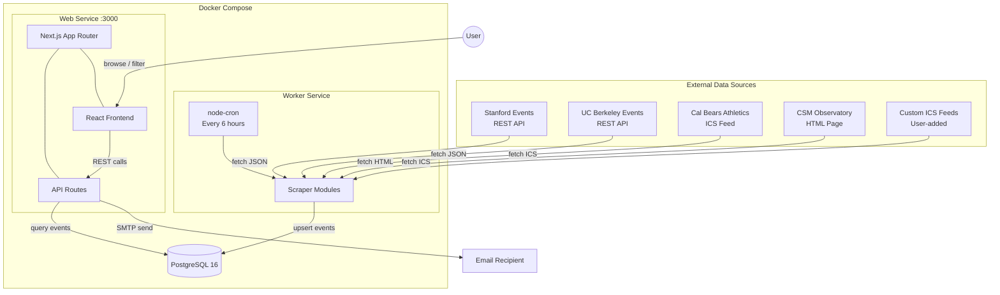
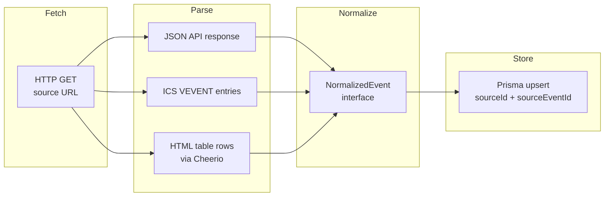
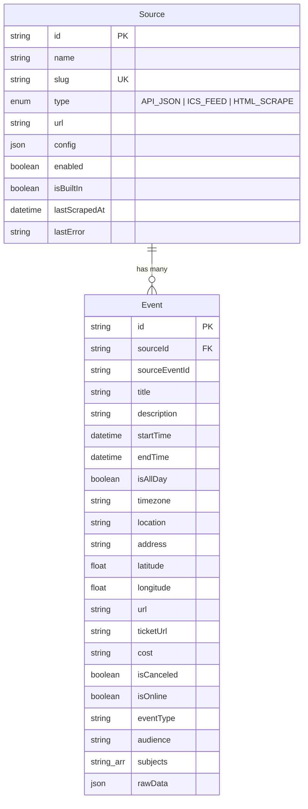
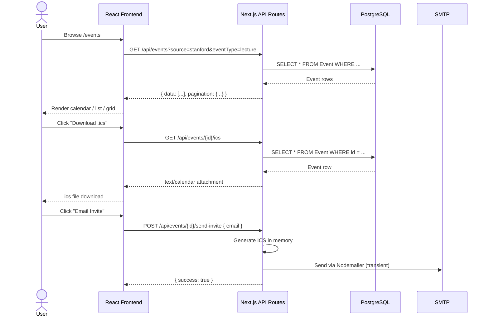
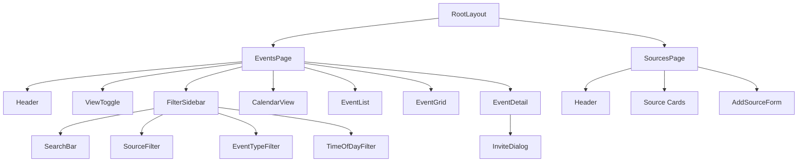

# Lecture Seeker

A Bay Area event aggregator that scrapes university and athletics calendars, normalizes the data, and presents it in a filterable calendar UI. Download `.ics` invites or email them directly -- with no persistent email logging.

## Architecture

### System Overview



### Scraper Pipeline



### Data Model



### Request Flow



### Frontend Component Tree



## Data Sources

| Source | Type | Strategy |
|--------|------|----------|
| [Stanford Events](https://events.stanford.edu) | REST API | Localist platform, paginated JSON at `/api/2/events` |
| [UC Berkeley Events](https://events.berkeley.edu) | REST API | LiveWhale CMS, paginated JSON at `/live/json/events/` |
| [Cal Bears Athletics](https://calbears.com/calendar) | ICS Feed | Sidearm Sports calendar at `/calendar.ashx/calendar.ics` |
| [CSM Observatory](https://collegeofsanmateo.edu/astronomy/observatory.asp) | HTML Scrape | Cheerio parses schedule table for "Jazz Under the Stars" |

Custom ICS feed URLs can be added through the Sources page in the UI.

## Tech Stack

| Layer | Technology |
|-------|-----------|
| Frontend | Next.js 15, React 19, Tailwind CSS, FullCalendar |
| UI Components | shadcn/ui (Radix primitives), Lucide icons |
| API | Next.js API Routes |
| Database | PostgreSQL 16, Prisma ORM |
| Scraping | undici (fetch), Cheerio (HTML), node-ical (ICS) |
| Worker | Node.js, node-cron |
| ICS Generation | `ics` npm package |
| Email | Nodemailer (direct SMTP, ephemeral) |
| Testing | Vitest |
| Monorepo | npm workspaces |

## Project Structure

```
lecture-seeker/
  docker-compose.yml
  vitest.config.ts
  packages/shared/           # Prisma schema, types, Zod schemas, constants
  apps/web/                  # Next.js frontend + API routes
    src/app/                 #   Pages and API route handlers
    src/components/          #   React components (calendar, filters, events, layout)
    src/lib/                 #   Utilities (Prisma client, ICS generator, email)
  apps/worker/               # Scraper worker service
    src/scrapers/            #   One module per data source + generic ICS
    src/index.ts             #   Entry point with cron scheduling
```

## Getting Started

### Prerequisites

- Docker and Docker Compose
- Node.js 22+ (for local development)

### Quick Start (Docker)

```bash
cp .env.example .env
# Edit .env with your DB_PASSWORD and optional SMTP settings
docker compose up
```

The web app will be available at `http://localhost:3000`. The worker will seed the four built-in sources and begin scraping on startup.

### Local Development

```bash
# Start just the database
docker compose up -d db

# Install dependencies
npm install

# Generate Prisma client and push schema
npm run db:generate
npm run db:push

# Seed built-in sources
npm run db:seed

# Start both web and worker in dev mode
npm run dev
```

### Running Tests

```bash
npm test              # Run all tests once
npm run test:watch    # Watch mode
npm run test:coverage # With coverage report
```

## API Reference

### Events

| Method | Endpoint | Description |
|--------|----------|-------------|
| `GET` | `/api/events` | List events with filtering and pagination |
| `GET` | `/api/events/[id]` | Get single event |
| `GET` | `/api/events/[id]/ics` | Download .ics calendar file |
| `POST` | `/api/events/[id]/send-invite` | Email .ics invite (body: `{ "email": "..." }`) |

**Query parameters for `GET /api/events`:**

| Param | Type | Description |
|-------|------|-------------|
| `page` | number | Page number (default: 1) |
| `limit` | number | Items per page (default: 50, max: 200) |
| `startAfter` | ISO date | Events starting after this time |
| `startBefore` | ISO date | Events starting before this time |
| `source` | string | Filter by source slug |
| `eventType` | string | Filter by type (lecture, sports, etc.) |
| `location` | string | Partial match on location |
| `isOnline` | boolean | Online events only |
| `q` | string | Full-text search |
| `timeOfDay` | string | `morning`, `afternoon`, or `evening` |

### Sources

| Method | Endpoint | Description |
|--------|----------|-------------|
| `GET` | `/api/sources` | List all sources |
| `POST` | `/api/sources` | Add custom ICS feed source |
| `PATCH` | `/api/sources/[id]` | Enable/disable a source |
| `DELETE` | `/api/sources/[id]` | Remove a custom source |

### Filters

| Method | Endpoint | Description |
|--------|----------|-------------|
| `GET` | `/api/filters` | Get available filter values (event types, sources, locations) |

## Email Configuration

Email sending is designed to be ephemeral with no logging:

- A transient Nodemailer SMTP transport is created per request
- The `.ics` file is generated in memory and attached
- The transport is destroyed after sending
- No email content is persisted to disk or database

Configure via environment variables:

```
SMTP_HOST=smtp.gmail.com
SMTP_PORT=587
SMTP_USER=your-email@gmail.com
SMTP_PASS=your-app-password
SMTP_FROM=noreply@yourdomain.com
```

Leave `SMTP_HOST` empty to disable email functionality (the .ics download still works).
